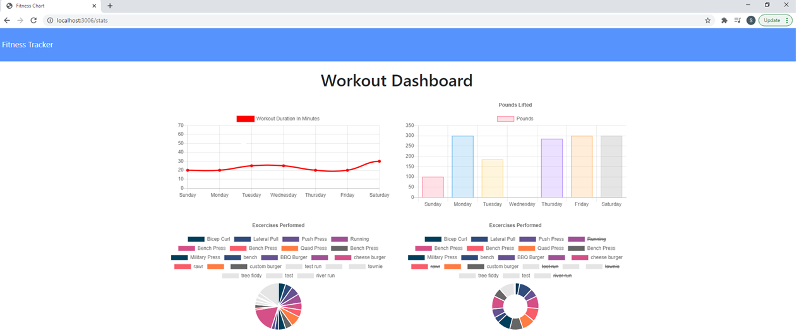

# Fitness Tracker

* This app has been created with the intention to be able to view create and track daily workouts. The user will be able to log multiple exercises in a workout on a given day. The user will also be able to track the name, type, weight, sets, reps, and duration of exercise. If the exercise is a cardio exercise, the user will be able to track their distance traveled.

Please see the following link for the deployed application: https://fitnesstracker808.herokuapp.com/exercise?id=60b84fdcf99be00015ab65f6

